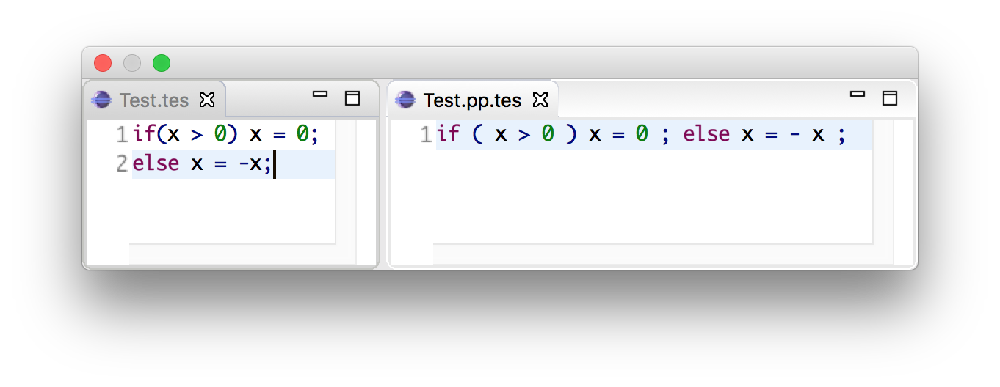
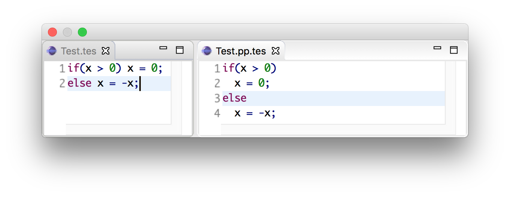

# Templates

Templates are a major change in SDF3 when comparing to SDF2.
They are essential when aiming to generate a nice pretty printer or generate proper syntactic code completion templates.
When generating such artifacts, a general production simply introduces a whitespace in between symbols.

For example, when writing a grammar rule

```
Statement.If = "if" "(" Exp ")" Exp "else" Exp
```

and pretty printing a valid program, we would get the text in a single line separated by spaces, as:

{ align=center }

Furthermore, code completion would consider the same indentation when inserting
code snippets.

However, when using template productions such as

```
Statement.If = <
  if ($Exp)
    $Exp
  else
    $Exp
```

We would get the following program:

{ align=center }

Again, code completion would also consider this indentation for proposals.

That is, in template productions, the surrounding layout is used to nicely pretty print programs and its code completion suggestions.


## Template Productions

Template productions are an alternative way of defining productions.
Similarly, they consist of a left-hand side and a right-hand side separated by ``=``.
The left-hand side is the same as for productive rules.
The right-hand side is a template delimited by ``<`` and ``>``.
The template can contain zero or more symbols:

```
$Sort              = < $Symbol* >
$Sort.$Constructor = < $Symbol* >
```

Alternatively, square brackets can be used to delimit a template:

```
$Sort              = [ $Symbol* ]
$Sort.$Constructor = [ $Symbol* ]
```

The symbols in a template can either be placeholders or literal strings.
It is worth noting that:

-  placeholders need to be enclosed within the same delimiters (either ``<...>`` or ``[...]``) as the template;
-  literal strings need not not be enclosed within quotation marks;
-  literal strings are tokenized on space characters (whitespace, tab);
-  additionally, literal strings are tokenized on boundaries between characters from the set given by the tokenize option, see the [`tokenize` template option](#tokenize);
-  placeholders translate literally. If a separator containing any layout characters is given, the placeholder maps to a list with separator that strips the layout.

An example of a template rule:

```
Exp.Addition = < $Exp + $Exp >
```

Here, the ``+`` symbol is a literal string and ``$Exp`` is a placeholder for sort ``Exp``.

Placeholders are of the form:

-  ``$Sort?``: optional placeholder
-  ``$Sort*``: repetition (0...n)
-  ``$Sort+``: repetition (1...n)
-  ``<{$Sort ","}*>``: repetition with separator


## Case-insensitive Literals

As we showed before, SDF3 allows defining case-insensitive literals as single-quoted strings in regular productions.
For example:

```
Exp.If = 'if' "(" Exp ")" Exp 'else' Exp
```

accepts case-insensitive keywords for ``if`` and ``else`` such as ``if``, ``IF``, ``If``, ``else``, ``ELSE`` or ``ELsE``.
However, to generate case-insensitive literals from template productions, it is necessary to add annotate these productions as case-insensitive.
For example, a template production:

```
Exp.If = <
  if($Exp)
    $Exp
  else
    $Exp
> {case-insensitive}
```

accepts the same input as the regular production mentioned before.

Moreover, lexical symbols can also be annotated as case-insensitive to parse as such.
The constructed abstract syntax tree contains lower-case symbols, but the original term is preserved via origin-tracking.
For example:

```
    ID = [a-zA-z][a-zA-Z0-9]* {case-insensitive}
```

can parse ``foo``, ``Foo``, ``FOo``, ``fOo``, ``foO``, ``fOO`` or ``FOO``.
Whichever option generates a node ``"foo"`` in the abstract syntax tree.
By consulting the origin information on this node, it is possible to know which term was used as input to the parser.


## Template options

Template options are options that are applied to the current file.
A template options section is structured as follows:

```
template options

    $TemplateOption*
```

Multiple template option sections are not supported.
If multiple template option sections are specified, the last one is used.

There are three kinds of template options.


### `keyword`

Convenient way for setting up lexical follow restrictions for keywords.
See the section on follow restrictions for more information.
The structure of the keyword option is as follows:

```
keyword -/- $Pattern
```

This will add a follow restriction on the pattern for each keyword in the language.
Keywords are automatically detected, any terminal that ends with an alphanumeric character is considered a keyword.

Multiple keyword options are not supported.
If multiple keyword options are specified, the last one is used.

Note that this only sets up follow restrictions, rejection of keywords as identifiers still needs to be written manually.


### `tokenize`

Specifies which characters may have layout around them. The structure of a tokenize option is as follows:

```
    tokenize : "$Character*"
```

Consider the following grammar specification:

```
template options

    tokenize : "("

context-free syntax

    Exp.Call = <<ID>();>
```

Because layout is allowed around the `(` and `)` characters, there may be layout between `()` and `;` in the template rule.
If no tokenize option is specified, it defaults to the default value of `()`.

Multiple tokenize options are not supported.
If multiple tokenize options are specified, the last one is used.


### `reject`

Convenient way for setting up reject rules for keywords.
See the section on [rejections](disambiguation.md#rejections) for more information.
The structure of the reject option
is as follows:

```
Symbol = keyword {attrs}
```

where ``Symbol`` is the symbol to generate the rules for.
Note that ``attrs`` can be include any attribute, but by using ``reject``, reject rules such as ``ID = "true" {reject}`` are generated for all keywords that appear in the templates.

Multiple reject template options are not supported.
If multiple reject template options are specified, the last one is used.
