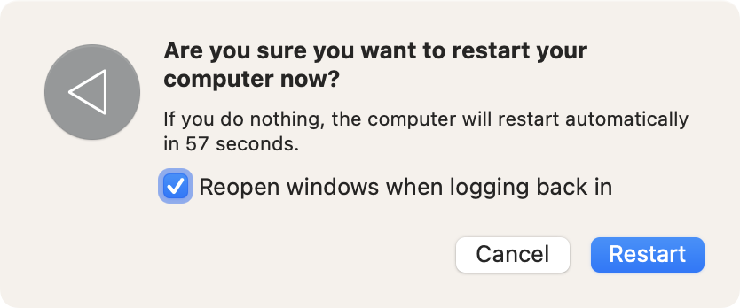

# Spoofax development troubleshooting
This page provides some troubleshooting information.


## Developing on macOS Catalina and newer
Due to some legacy 32-bit binaries (`sdf2table` and `implodePT`) that are required to build some of the Spoofax meta-languages, building on {{os.macos}} Catalina or newer (Big Sur, Monterey) requires the following additional components to be installed:

- `coreutils`
- Docker for Mac

Refer to the [Requirements](requirements.md) page for more information and installation instructions. The following subsections detail some problems that can occur when developing on macOS Catalina or newer.


### Command failed: sdf2table
Errors with `sdf2table` or `implodePT` similar to the following:

```
Exception thrown during build. Required builder failed. Error occurred in build step "Compile grammar to parse table": org.sugarj.common.Exec$ExecutionError: Command failed:  sdf2table -t -i myproject/src-gen/sdf3/myproject-permissive.def -m myproject -o myproject/target/metaborg/sdf.tbl
```

These are usually caused by Docker not being available on the `$PATH` in Eclipse.  Inspect the log on the command-line, or in `/tmp/sdf2table.log` or `/tmp/implodePT.log` for more details.  The two most common errors found in the log are:


#### docker: command not found
If you are sure Docker is installed, it's probably not on the path in Eclipse.  Find out the path to the Docker executable using:

```shell
which docker
```

For example, if Docker is installed using Homebrew, this might return:

```
/usr/local/bin/docker
```

Inspecting the `$PATH` printed in the log, we see that `/usr/local/bin` is not there:

```
$PATH: /usr/bin:/bin:/usr/sbin:/sbin
```

Note that this `$PATH` variable is used in the macOS GUI applications, and independent from the one used in a local terminal.  (This means `/usr/local/bin` might be present when just executing `echo $PATH`.)  To fix this, we need to modify the `$PATH` variable for all graphical applications and for all users.

First, verify the current setting:

```shell
launchctl getenv PATH
```

If this prints anything, that's the current `$PATH` for graphical applications. If this prints nothing, as is the default, then the default `$PATH` can be determined as follows:

```shell
sysctl user.cs_path
```

This prints:

```
user.cs_path: /usr/bin:/bin:/usr/sbin:/sbin
```

Now, we need to modify the path to include the `/usr/local/bin`, or wherever Docker is installed. We will take the current path (or the default path) and prefix it with the desired path.

```shell
sudo launchctl config user path /usr/local/bin:/usr/bin:/bin:/usr/sbin:/sbin
```

It will print:

```
Configuration applied. You must reboot for changes to take effect.
```

Finally, reboot the computer. Until the system has been rebooted, these changes are not applied. After rebooting, we can verify that the `$PATH` for graphical applications has been set correctly:

```shell
launchctl getenv PATH
```

This should print:

```
/usr/local/bin:/usr/bin:/bin:/usr/sbin:/sbin
```

!!! warning "Reopen windows when logging back in"
    If the option to _Reopen windows when logging back in_ is enabled when restarting, any running Eclipse instance will be restored with the original (incomplete) `$PATH`.
    Make sure to close any running instance of Spoofax Eclipse, verify that it has quit completely, then start it again.

    { width="350" }


#### Cannot connect to the Docker daemon
The following error indicates that the Docker daemon might not be running.  Ensure Docker has been started.

```
ERROR: Cannot connect to the Docker daemon at unix:///var/run/docker.sock. Is the docker daemon running?
```


### Mounts denied: The path is not shared the host and is not known to Docker
```
Error response from daemon: Mounts denied:
The path /var/folders/a_/foo0000bar/T/vfs_cache-345/tmp_123_macosx/sdf2table-macosx
is not shared from the host and is not known to Docker.
```

Ensure the root of the path (`/var/folders` in this example) is shared in Docker for Mac. Go to Docker for Mac _Preferences_ ‣ _Resources_ ‣ _File Sharing_ and add the path to the list. The default list should contain:

- `/Users`
- `/Volumes`
- `/private`
- `/tmp`
- `/var/folders`


### invalid mount config for type "bind": bind source path does not exist
```
Error response from daemon: invalid mount config for type "bind":
bind source path does not exist:
/var/folders/a_/foo0000bar/T/vfs_cache-345/tmp_123_macosx
```

Ensure that both Docker and the terminal from which you are invoking the build have _full-disk access_. Go to macOS _Preferences_ ‣ _Security and Privacy_ ‣ _Full Disk Access_ and check the checkboxes next to _Docker_ and your terminal (_Terminal_ and/or _iTerm_).
